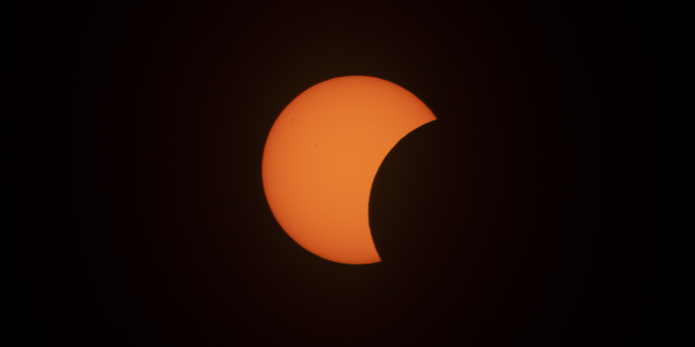

# Eclipse Photography Automation

(Nearly) unattended eclipse photography for an old Nikon DSLR
tethered over USB, which I built for my 2012-era Nikon D5500 and a Mac, for the
2026 total eclipse. 



If you've looked into automating eclipse photography on a
Mac, you've probably found the same thing I did: the tooling is thin,
the Nikon-specific behavior is undocumented, and most guides assume a
newer camera body or specific software. [Eclipse Maestro](http://xjubier.free.fr/en/site_pages/solar_eclipses/Solar_Eclipse_Maestro_Photography_Software.html) used to be the free tool of choice, but unfortunately it doesn't support newer macOS builds. This project exists because none of the existing options for macOS (that I could find) were both *hands-off* and *trustworthy* for an event that happens once, lasts only ninety seconds, and cannot be reshot! Please note that while this repo was designed and tested for macOS, much of the code may still work on other OSes. Feel free to try or adapt for your use-case.

## What it does

- Computes your local eclipse contact times (C1–C4) from your coordinates
- Runs a fully automated shooting sequence: filtered partial phases,
  diamond ring / Baily's beads bursts, and a totality exposure bracket -
  all scheduled against real contact times, no manual triggering
- Recovers from a dropped USB connection, a sleeping laptop, or a battery
  swap mid-event, and resumes where it left off
- Gives you spoken cues for the things a script can't do for you: take
  the solar filter off, put it back on, check your framing
- Has been rehearsed and load-tested extensively before ever pointing at
  the real sun - see [`docs/architecture.md`](docs/architecture.md) for
  how

## Built for, and what should transfer

This was built and tuned against one specific setup: a **Nikon D5500**,
a **55-300mm Nikkor DX lens** (450mm full-frame equivalent, max zoom), shooting **RAW**, tethered
over **USB to a Mac**, for a **near-horizon eclipse** (a few degrees of
solar altitude, meaning significant atmospheric extinction — see
[`docs/exposure-design.md`](docs/exposure-design.md)).

Most of the camera-control layer (`src/eclipse/camera.py`) should work
with any gphoto2-supported camera with only config changes — but several
of the fixes in this codebase exist *because* of specific,
undocumented Nikon/macOS behavior. If you're on different hardware, read
[`docs/camera-notes.md`](docs/camera-notes.md) before assuming something
that broke for me won't break for you too, and vice versa.

## ⚠️ Safety

Never point a camera (or your eyes) at the sun without a proper solar
filter, except during the few minutes of total eclipse itself. The
bracket plans in `src/eclipse/bracket_plans.py` are built around exact
filter-on/filter-off timing — if you adapt this project, understand that
timing before you change it.

## Quickstart

```bash
brew install uv libgphoto2 gphoto2   # uv, the python bindings, and the CLI tool
git clone https://github.com/dibz15/eclipse-photography && cd eclipse-photography
uv sync --extra dev --extra camera

cp config.example.yaml config.yaml   # then fill in your coordinates
uv run eclipse-timings --write       # compute and lock in contact times

uv run eclipse-throughput --list-image-quality   # discover your camera's
uv run eclipse-throughput --bracket-test --write # real settings & timing

uv run eclipse-rehearse --dry-run    # rehearse the full schedule, no camera
uv run eclipse-rehearse              # rehearse with the real camera
```

Full walkthrough, including what each of the six `eclipse-*` commands is
for and when to run it: [`docs/workflow.md`](docs/workflow.md).

## Documentation

| Doc | For |
|---|---|
| [`docs/setup.md`](docs/setup.md) | Installing on a fresh Mac, prerequisites, first-time config |
| [`docs/workflow.md`](docs/workflow.md) | The week-before -> day-of sequence, and what every command does |
| [`docs/config-reference.md`](docs/config-reference.md) | Every `config.yaml` field, what sets it, what reads it |
| [`docs/camera-notes.md`](docs/camera-notes.md) | Nikon/gphoto2/macOS-specific bugs and quirks we hit, and the fixes. Read this if you're adapting the camera layer |
| [`docs/exposure-design.md`](docs/exposure-design.md) | The photography/astronomy reasoning behind the bracket plans; extinction, trailing, per-step ISO, focus |
| [`docs/architecture.md`](docs/architecture.md) | Module map, testing conventions, how to adapt this to a different camera, site, or date |

## Status

Used for real on 2026-08-12 from Mallorca, Spain. The specific bracket tunings in `bracket_plans.py` and
`config.example.yaml` reflect that site and that camera; treat the
*numbers* as a worked example and the *mechanisms* (recovery, timing
math, safety guards) as the reusable part.

## Totality framing help

If you don't have a star tracking mount, the sun during totality will drift through your frame. Over 400mm focal length, this can become a considerable portion of your frame, even during a short totality. To check how the sun will drift through your camera frame during totality, I created a framing UI to help you figure out the perfect framing pre-totality for your eclipse. You can access the UI here: [https://dibz15.github.io/eclipse-photography/](https://dibz15.github.io/eclipse-photography/).

Copyright 2026 Dibz15 - MIT License. See [LICENSE](./LICENSE)